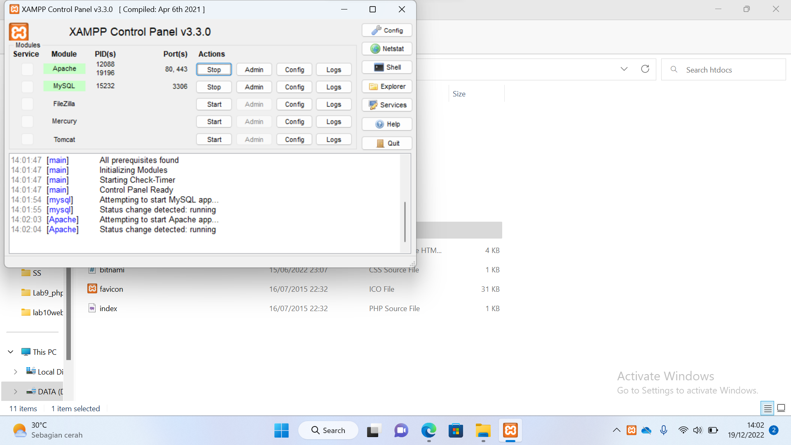
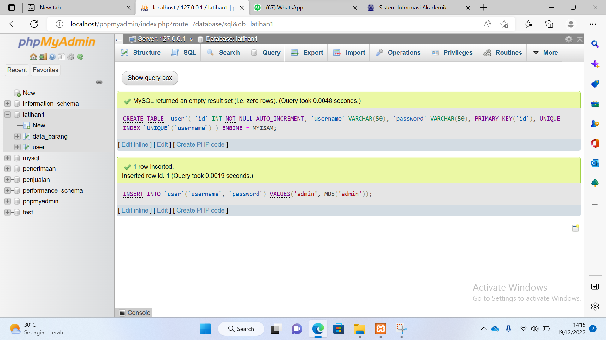
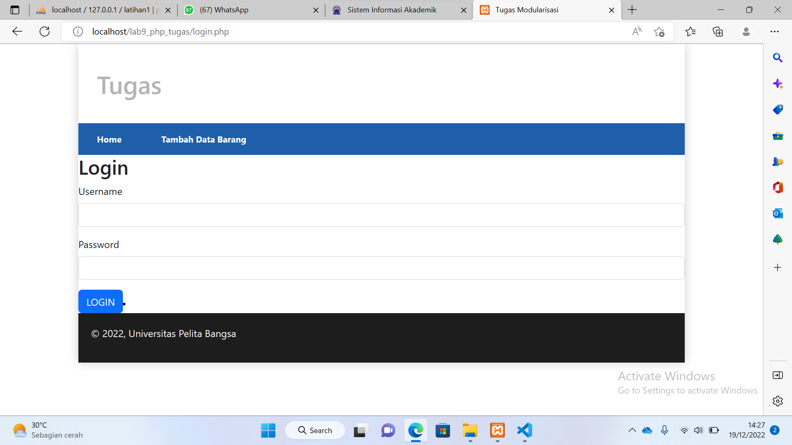
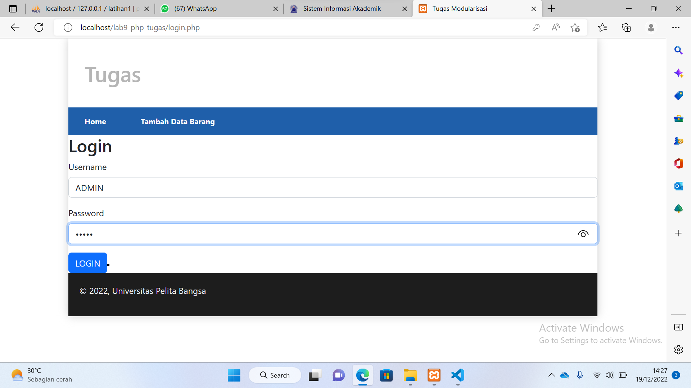
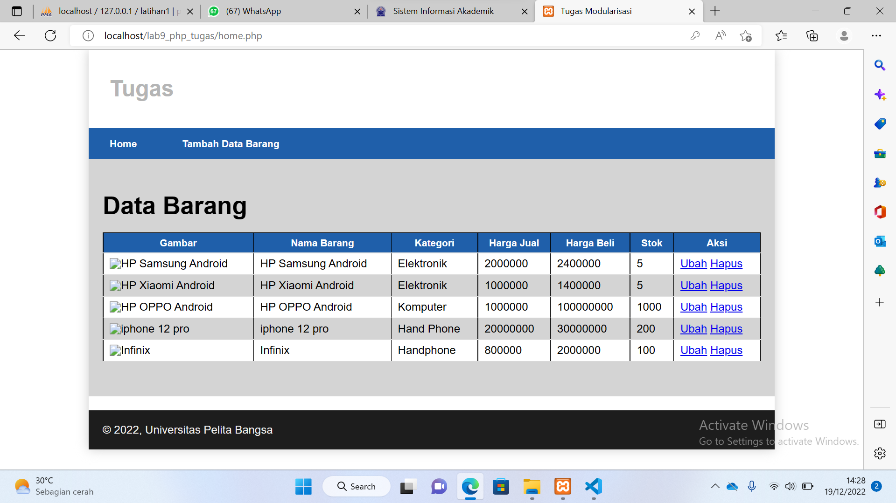

# Lab11Web

|NAMA   |ANDRE MAHADI |
| --- | --- |
| NIM   | 312110221 |
| KELAS | TI.21.B1 |
| DOSEN | Agung Nugroho,S.Kom.,M.Kom |
| Matkul| Pemograman web |
|Pertemuan| KE 12 |
|Kampus | UNIVERSITAS PELITA BANGSA |

1. Buka xampp Hidupkan Apache & Mysql

2. Bikin Create Table User 

git
3. Tampilan Login

4. Masukan Username & Password

5. Login Berhasil Munculnya Database
